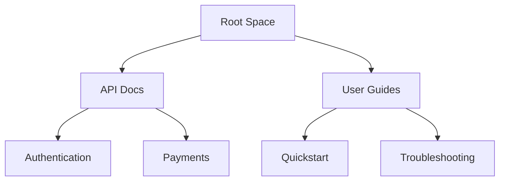

## Overview

Oleg Parashchuk provides powerful tools to organize, collaborate on, search, and track changes in your project documentation. You create structured spaces for all your docs, enabling teams to work efficiently without losing context.

<Columns cols={2}>
  <Card title="Document Organization" icon="folder" href="#document-organization">
    Build intuitive hierarchies with folders and pages.
  </Card>
  <Card title="Collaboration Tools" icon="users" href="#collaboration">
    Real-time editing and permissions for teams.
  </Card>
  <Card title="Search & Filtering" icon="search" href="#search">
    Find content instantly across your space.
  </Card>
  <Card title="Version History" icon="git-branch" href="#version-history">
    Track every change with full revert capabilities.
  </Card>
</Columns>

## Document Organization and Hierarchy

Organize your documentation into a clear hierarchy using folders, subfolders, and pages. You nest content logically, such as `/api/reference/endpoint-details`, to match your project's structure.



<Steps>
  <Step title="Create Folders" icon="folder-plus">
    Navigate to your space root and select `New Folder`. Name it descriptively, like `Core API`.
  </Step>
  <Step title="Add Pages" icon="file-plus">
    Inside a folder, create pages with `New Page`. Use frontmatter for metadata:
    
````yaml
---
title: Endpoint Details
description: API endpoint reference
---
````
    
  </Step>
  <Step title="Reorder" icon="move">
    Drag and drop items in the sidebar to adjust hierarchy.
  </Step>
</Steps>

## Collaboration and Editing Tools

Invite team members and assign roles like Editor, Viewer, or Admin. You enable real-time collaborative editing with live cursors and comments.

<Tabs>
  <Tab title="Editor Role" icon="edit-3">
    Full editing access. Use `@mentions` in comments to notify teammates.
    
    <Callout kind="tip">
      Enable rich text, MDX components, and embeds for dynamic docs.
    </Callout>
  </Tab>
  <Tab title="Viewer Role" icon="eye">
    Read-only access. Suggest edits via comments without altering content.
  </Tab>
  <Tab title="Admin Role" icon="shield">
    Manage spaces, users, and settings. Set custom permissions per folder.
  </Tab>
</Tabs>

For programmatic collaboration, use the API:

<CodeGroup tabs="JavaScript,Python">
  ```javascript
  const response = await fetch('https://api.example.com/v1/spaces/{spaceId}/invite', {
    method: 'POST',
    headers: { 'Authorization': `Bearer ${YOUR_API_KEY}` },
    body: JSON.stringify({ email: 'user@example.com', role: 'editor' })
  });
  ```
  ```python
  import requests
  response = requests.post(
      'https://api.example.com/v1/spaces/{spaceId}/invite',
      headers={'Authorization': f'Bearer {YOUR_API_KEY}'},
      json={'email': 'user@example.com', 'role': 'editor'}
  )
  ```
</CodeGroup>

<ParamField path="spaceId" param-type="string" required="true">
  Your documentation space identifier.
</ParamField>

<ParamField body="role" param-type="string" required="true">
  Role to assign: `editor`, `viewer`, or `admin`.
</ParamField>

## Search and Filtering Capabilities

Search across all documents with full-text indexing. Filter by tags, dates, or authors for precise results.

| Filter Type | Description | Example Query |
|-------------|-------------|---------------|
| Tags | Match document tags | `tag:api` |
| Date Range | Recent changes | `created:>2024-01-01` |
| Author | Specific contributor | `author:john@example.com` |

<Callout kind="info">
  Advanced search supports boolean operators like `api AND authentication`.
</Callout>

## Version History Tracking

Every edit creates a snapshot. You view diffs, restore versions, or compare changes.

<Expandable title="Advanced Version Controls" default-open="false">
  Access history via sidebar. Revert with one click or cherry-pick changes.
  
  API example for fetching history:
  
````javascript
const history = await fetch(`https://api.example.com/v1/pages/{pageId}/history`, {
  headers: { 'Authorization': `Bearer ${YOUR_API_KEY}` }
});
````
</Expandable>

Track changes programmatically to audit team activity and maintain compliance in your Oleg Parashchuk documentation space.